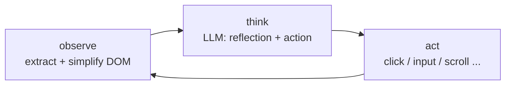

# Page Agent

[](https://github.com/kylebrodeur/page-agent/actions/workflows/ci.yml)
[](https://www.npmjs.com/package/@kylebrodeur/page-agent)
[](https://opensource.org/licenses/MIT)
[](http://www.typescriptlang.org/)

**Headless in-page GUI agent.** An LLM operates your web page through natural language — no browser extension, no headless browser, no screenshots. Just in-page JavaScript.

This is a headless-first fork of [alibaba/page-agent](https://github.com/alibaba/page-agent): the built-in UI Panel is removed, so you bring your own interface (React, Arrow.js, vanilla — anything that can listen to DOM events).

## Packages

| Package                                   | What it is                                                                    |
| ----------------------------------------- | ----------------------------------------------------------------------------- |
| `@kylebrodeur/page-agent`                 | Headless entry point. `PageAgentCore` wired to the default `PageController`   |
| `@kylebrodeur/page-agent-core`            | The agent loop alone — bring your own `PageController`                        |
| `@kylebrodeur/page-agent-page-controller` | DOM observation, element actions, and the visual `SimulatorMask`              |
| `@kylebrodeur/page-agent-llms`            | OpenAI-compatible LLM client with reflection-before-action and retry          |
| `@kylebrodeur/page-agent-mcp`             | MCP server that drives the browser extension ([docs](packages/mcp/README.md)) |

## Quick Start

```bash
pnpm add @kylebrodeur/page-agent
```

```typescript
import { PageAgent } from '@kylebrodeur/page-agent'

const agent = new PageAgent({
    model: 'qwen3.5-plus',
    baseURL: 'https://api.your-llm-provider.com/v1',
    apiKey: 'YOUR_API_KEY',
    language: 'en-US',
    enableMask: true, // visual overlay while the agent works (default: true)
})

const result = await agent.execute('Click the login button')
// result: { success: boolean, data: string, history: HistoricalEvent[] }
```

Works with any OpenAI-compatible endpoint, including local models (Ollama etc.).

## How Headless Works

`PageAgent` = `PageAgentCore` (the agent loop) + `PageController` (DOM access). There is no UI code in any published package — the agent reports everything through events, and you render them however you want.

The loop is ReAct-style, up to `maxSteps` (default 40):



### Building your own UI

`PageAgentCore` extends `EventTarget`. Everything a panel needs comes from four events:

| Event           | Payload                                                                        | Use for                                    |
| --------------- | ------------------------------------------------------------------------------ | ------------------------------------------ |
| `statuschange`  | read `agent.status`: `idle \| running \| completed \| error \| stopped`        | start/stop buttons, spinners               |
| `activity`      | `CustomEvent.detail`: `thinking`, `executing`, `executed`, `retrying`, `error` | live feedback line (transient, not memory) |
| `historychange` | read `agent.history`: steps, observations, errors (agent memory)               | step-by-step transcript                    |
| `dispose`       | —                                                                              | teardown                                   |

```typescript
agent.addEventListener('statuschange', () => render(agent.status))

agent.addEventListener('activity', (e) => {
    const activity = (e as CustomEvent).detail
    if (activity.type === 'executing') showToast(`${activity.tool}...`)
})

agent.addEventListener('historychange', () => renderTranscript(agent.history))

// Let the agent ask the user questions (enables the ask_user tool):
agent.onAskUser = async (question) => window.prompt(question) || ''

// Stop from your UI:
await agent.stop()
```

## Configuration

All of `PageAgentConfig` (main package) = `AgentConfig` + `PageControllerConfig`:

| Field                                                           | Default | Description                                              |
| --------------------------------------------------------------- | ------- | -------------------------------------------------------- |
| `baseURL`, `model`                                              | —       | OpenAI-compatible endpoint and model (required)          |
| `apiKey`                                                        | —       | API key                                                  |
| `language`                                                      | `zh-CN` | Agent language (`en-US` \| `zh-CN`)                      |
| `maxSteps`                                                      | `40`    | Step budget per task                                     |
| `stepDelay`                                                     | `0.4`   | Seconds between steps                                    |
| `enableMask`                                                    | `true`  | Visual overlay blocking user input while running         |
| `maxRetries`                                                    | —       | LLM retry attempts                                       |
| `instructions.system`                                           | —       | Extra system-level instructions for every task           |
| `instructions.getPageInstructions`                              | —       | Per-URL instructions, called before each step            |
| `customTools`                                                   | —       | Add, override, or remove (set `null`) agent tools        |
| `transformPageContent`                                          | —       | Hook to inspect/mask page text before it reaches the LLM |
| `onBeforeTask` / `onAfterTask` / `onBeforeStep` / `onAfterStep` | —       | Lifecycle hooks (experimental)                           |

### Custom tools

```typescript
import { tool } from '@kylebrodeur/page-agent'
import * as z from 'zod/v4'

const agent = new PageAgent({
    // ...llm config
    customTools: {
        get_weather: tool({
            description: 'Get the current weather for a city.',
            inputSchema: z.object({ city: z.string() }),
            execute: async ({ city }) => `Sunny in ${city}`,
        }),
        ask_user: null, // remove a built-in tool
    },
})
```

### Custom PageController (advanced)

`@kylebrodeur/page-agent-core` takes any object implementing the `PageController` contract, so the same agent loop can drive other targets (an iframe, a remote tab, a test harness):

```typescript
import { PageAgentCore } from '@kylebrodeur/page-agent-core'
import { PageController } from '@kylebrodeur/page-agent-page-controller'

const agent = new PageAgentCore({
    // ...llm config
    pageController: new PageController({ enableMask: true }),
})
```

## IIFE Demo Build

The main package also ships a self-initializing IIFE (`dist/iife/page-agent.demo.js`) for quick evaluation on any page:

```html
<script
    src="https://cdn.jsdelivr.net/npm/@kylebrodeur/page-agent@1.13.0/dist/iife/page-agent.demo.js"
    crossorigin="anonymous"
></script>
```

Query params: `?autoInit=false` (load without creating an agent — then `new window.PageAgent(...)` yourself), `model`, `baseURL`, `apiKey`, `lang`.

> **⚠️ Evaluation only.** Without explicit config it falls back to upstream's free testing LLM endpoint; see the [terms](docs/terms-and-privacy.md).

## Development

See [docs/developer-guide.md](docs/developer-guide.md) for local workflows, and [CONTRIBUTING.md](CONTRIBUTING.md) for contribution rules.

```bash
pnpm install
pnpm build:libs      # build all publishable packages
pnpm test            # unit tests
pnpm publish:libs    # publish (ordered, token via 1Password)
```

## License

[MIT](LICENSE)

## Acknowledgments

Fork of [alibaba/page-agent](https://github.com/alibaba/page-agent) by Simon ([@gaomeng1900](https://github.com/gaomeng1900)).

DOM processing components and prompts are derived from [browser-use](https://github.com/browser-use/browser-use) (MIT, Copyright (c) 2024 Gregor Zunic). We gratefully acknowledge both projects.
